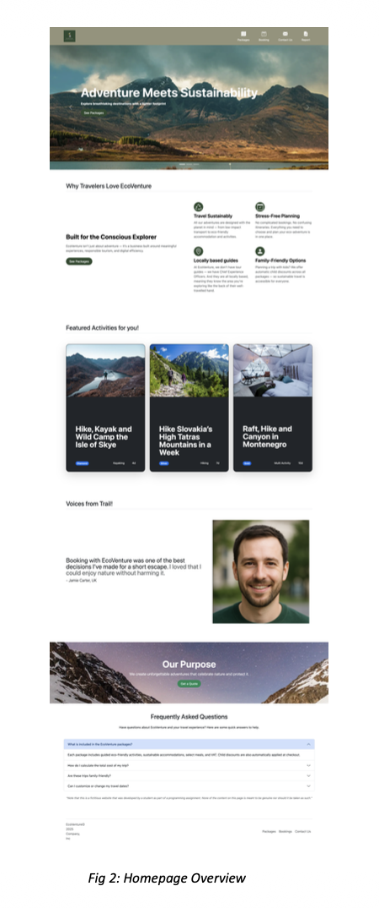
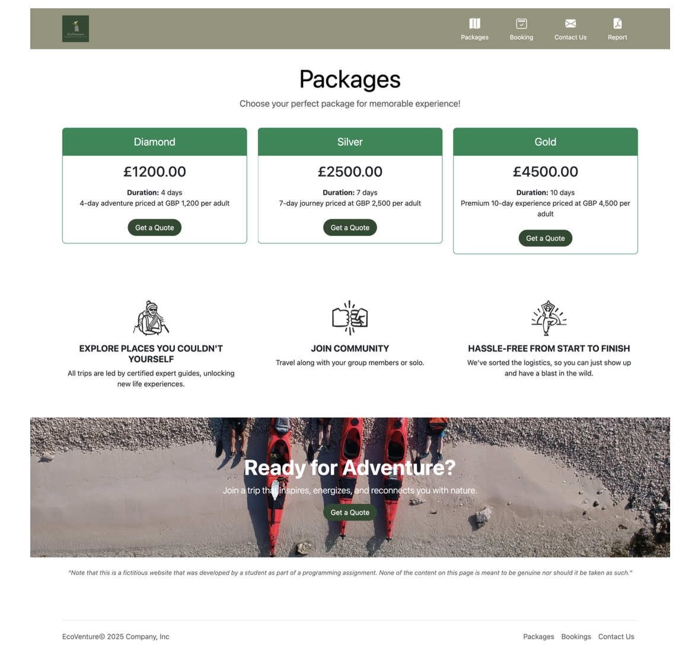
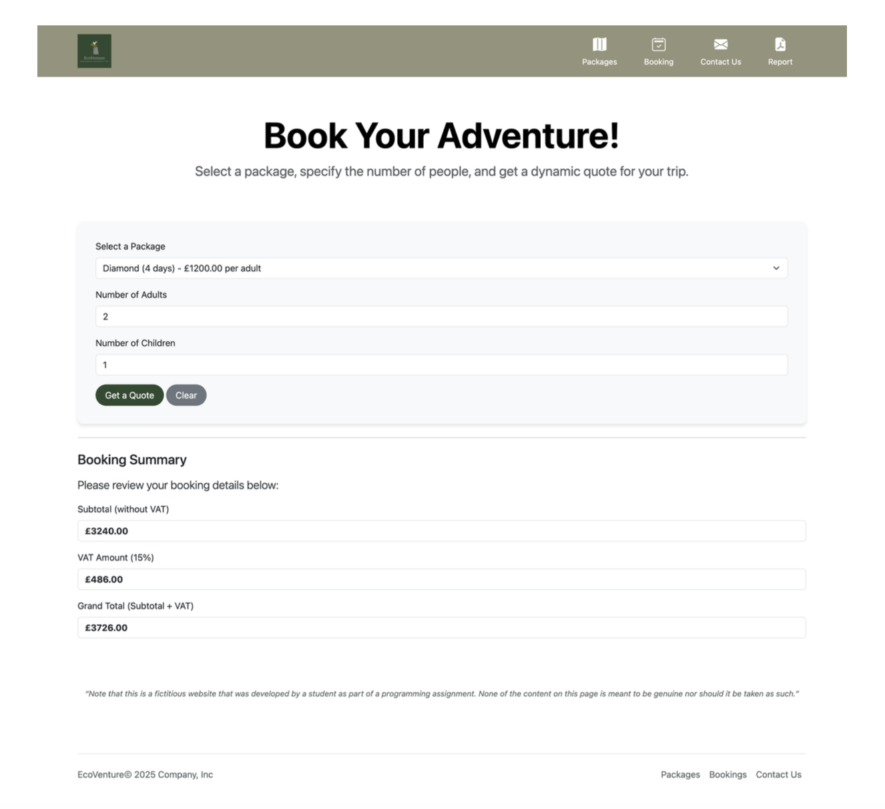
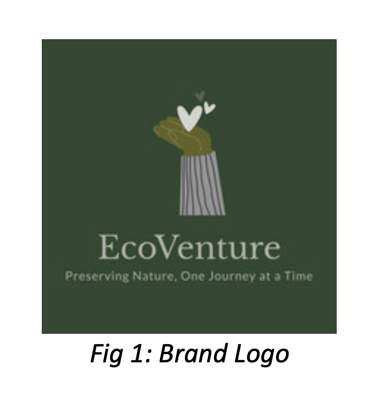

# EcoVenture - Sustainable Tourism Booking Platform

EcoVenture is a responsive full-stack tourism website designed to promote sustainable and eco-conscious travel experiences. The platform enables users to explore travel packages, calculate personalized trip costs, and submit booking enquiries through an intuitive and visually engaging interface.

---

## Features

- Sustainable tourism focused website
- Responsive UI using Bootstrap
- Dynamic travel package listings
- Personalized trip cost calculator
- PHP and MySQL database integration
- Booking form validations
- Dynamic pricing calculations
- Contact form for customer enquiries
- Accessibility friendly design
- Mobile responsive layouts

---

## Technologies Used

| Technology | Purpose |
|-----------|-----------|
| HTML | Website structure |
| CSS | Styling |
| Bootstrap | Responsive UI components |
| JavaScript | Dynamic calculations |
| PHP | Backend functionality |
| MySQL | Package data management |

---

## Website Pages

### Homepage

- Hero section with nature-themed carousel images
- Featured eco-tourism experiences
- Testimonials section
- FAQ section
- Responsive navigation and footer

### Packages Page

- Dynamically fetched travel packages
- Modern card-based layout
- Package pricing and duration
- Call-to-action buttons for booking

### Booking Page

Users can:

- Select travel packages
- Enter number of adults and children
- Generate a booking quote instantly

The booking calculator includes:

- Child discount calculation (30%)
- VAT calculation (15%)
- Grand total computation
- Input validations
- Reset functionality

### Contact Us Page

Features include:

- Contact enquiry form
- Email validation
- Phone number validation
- Alternative support information

---

## Dynamic Pricing Logic

The trip cost is calculated based on:

- Selected destination/package
- Package duration
- Number of adults
- Number of children
- Child ticket discount
- VAT charges

Formula:

Subtotal = Package Cost - Child Discount

VAT = 15% of Subtotal

Grand Total = Subtotal + VAT

---

## Development Process

The project was developed using:

- User research of existing travel websites
- Bootstrap components and templates
- Custom CSS styling
- PHP and MySQL integration
- Responsive design principles
- Accessibility considerations
- Dynamic data rendering

---

## Screenshots

### Homepage

### Packages Page

### Booking Page

### Logo

---

## Future Improvements

- Payment gateway integration
- User authentication
- Booking confirmation emails
- Admin dashboard
- Review and rating system
- Google Maps integration
- Sustainable travel recommendations using AI

---

## Learning Outcomes

This project helped me gain hands-on experience in:

- Full-stack web development
- PHP and MySQL integration
- Responsive UI design
- Form validation
- Dynamic pricing logic
- Bootstrap framework
- Website accessibility and usability principles

---

## Author

Nikita Kishore
